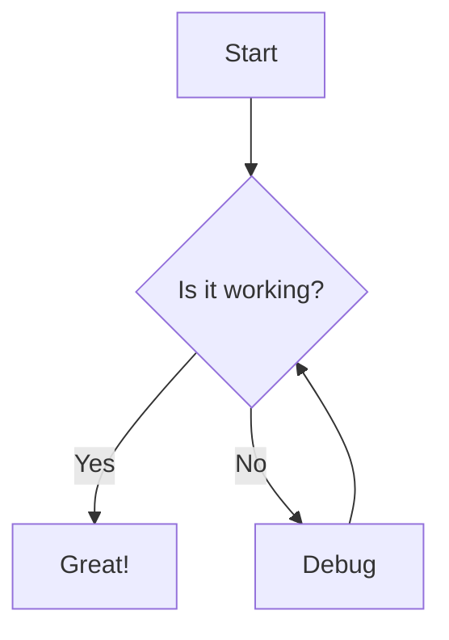
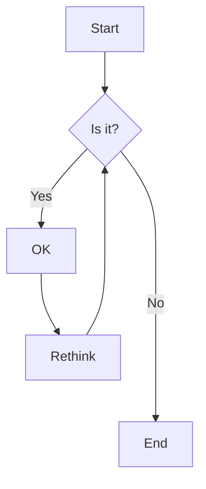
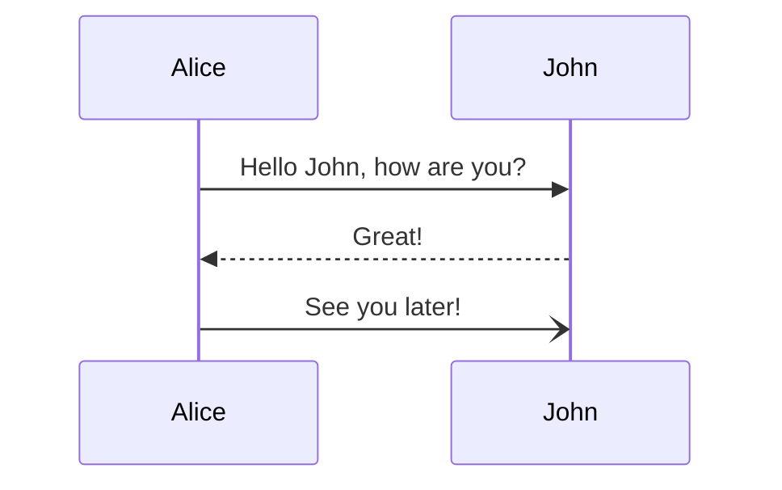
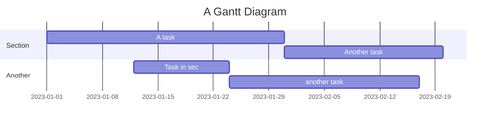

# Using Mermaid Diagrams in Chat

The chat now supports rendering Mermaid diagrams directly within messages. Mermaid is a JavaScript-based diagramming and charting tool that renders Markdown-inspired text definitions to create and modify diagrams dynamically.

## How to Use Mermaid Diagrams

You can create Mermaid diagrams in your messages in two ways:

### 1. Using Code Blocks with Mermaid Language



### 2. Using Plain Code Blocks (Auto-Detection)

The system will automatically detect Mermaid syntax in code blocks even without specifying the language:

```
flowchart LR
    A[Square Rect] -- Link text --> B((Circle))
    A --> C(Round Rect)
    B --> D{Rhombus}
    C --> D
```

## Supported Diagram Types

- Flowcharts (`graph` or `flowchart`)
- Sequence Diagrams (`sequenceDiagram`)
- Class Diagrams (`classDiagram`)
- State Diagrams (`stateDiagram`)
- Entity Relationship Diagrams (`erDiagram`)
- Gantt Charts (`gantt`)
- Pie Charts (`pie`)
- User Journey (`journey`)
- Git Graph (`gitGraph`)

## Examples

### Flowchart



### Sequence Diagram



### Gantt Chart



## Troubleshooting

If a diagram doesn't render correctly:

1. Check your syntax against the [Mermaid documentation](https://mermaid.js.org/intro/syntax-reference.html)
2. Ensure there are no extra spaces at the beginning of lines
3. Use the correct diagram type identifier at the beginning of your code block

For more details and advanced usage, refer to the [official Mermaid documentation](https://mermaid.js.org/). 